# Structurizr + MCP Server — Architecture as Code with Claude

> Self-hosted [Structurizr](https://structurizr.com/) combined with an MCP Server integration for [Claude Desktop](https://claude.ai/download). Describe your software architecture in plain language — Claude generates valid [C4 Model](https://c4model.com/) diagrams directly in Structurizr.

---

## What This Is

This setup connects Claude Desktop to a self-hosted Structurizr instance via the [Model Context Protocol (MCP)](https://modelcontextprotocol.io/). Claude can read, validate, and generate [Structurizr DSL](https://docs.structurizr.com/dsl) workspaces — and render them as C4 diagrams without manual editing.

**Typical flow:**

```
Describe your system in plain language  ─or─  sketch it by hand
        ↓
Claude reads the text or image and generates a validated Structurizr DSL workspace
        ↓
Paste the DSL into Structurizr
        ↓
C4 diagrams are rendered automatically
```

---

## Example: PIM System

The included example models a **Product Information Management (PIM) System** — a realistic, multi-tier enterprise application.

### Prompt

[`pim-prompt.txt`](pim-prompt.txt) contains the plain-language description used as input for Claude:

- 3 personas (Product Manager, Supplier, Channel)
- 3 software systems (PIM, ERP, Shop)
- 8 containers with technology tags
- Components for two services
- Full relationship mapping
- Kubernetes production deployment
- 5 C4 views with auto-layout and styles

### Generated DSL

[`PIM-dsl.json`](PIM-dsl.json) is the Structurizr DSL workspace produced by Claude from the prompt above. It can be imported directly into Structurizr.

### Rendered Diagrams

The diagrams below were rendered by Structurizr from the generated DSL:

| View | Diagram |
|---|---|
| System Context | 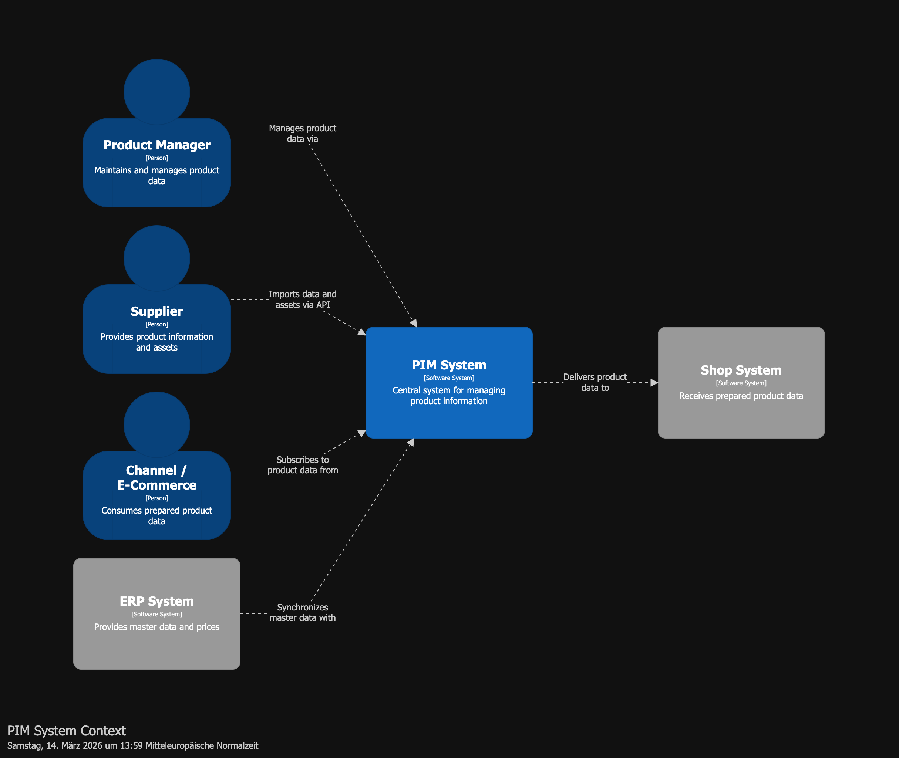 |
| Container Overview | 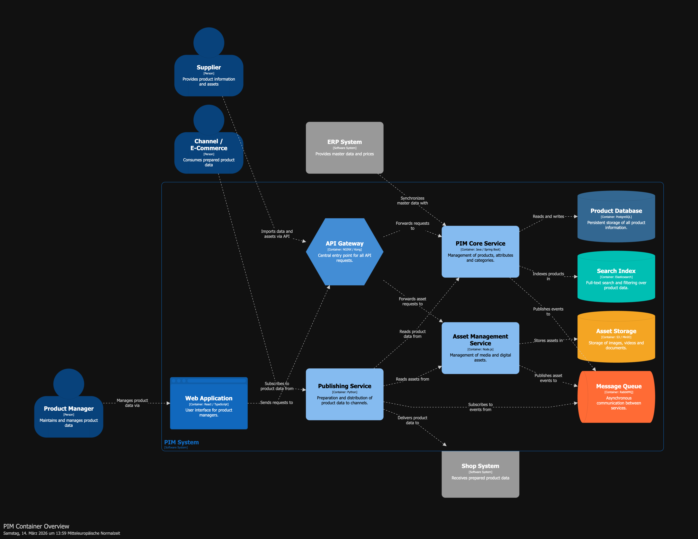 |
| Core Service Components | 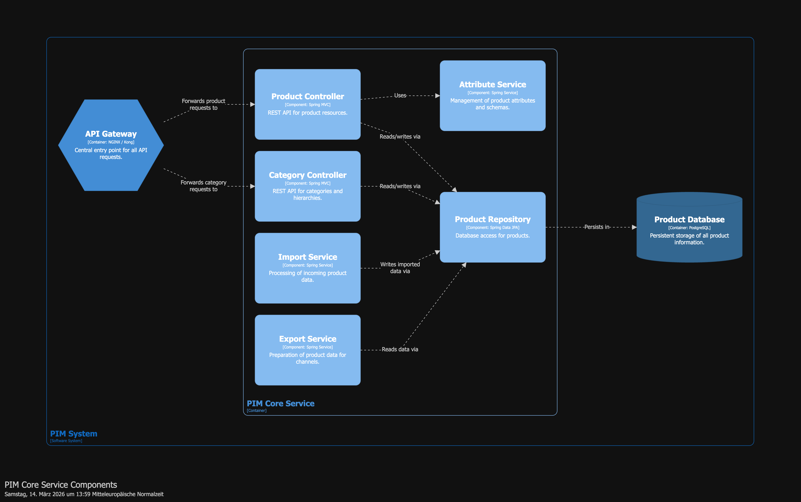 |
| Asset Service Components | 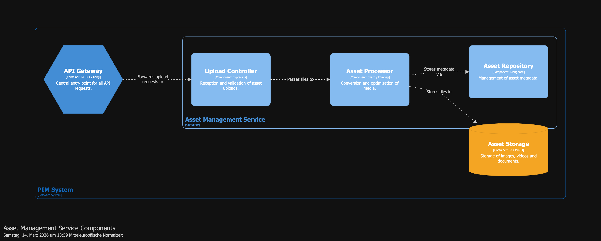 |
| Deployment (Production) | 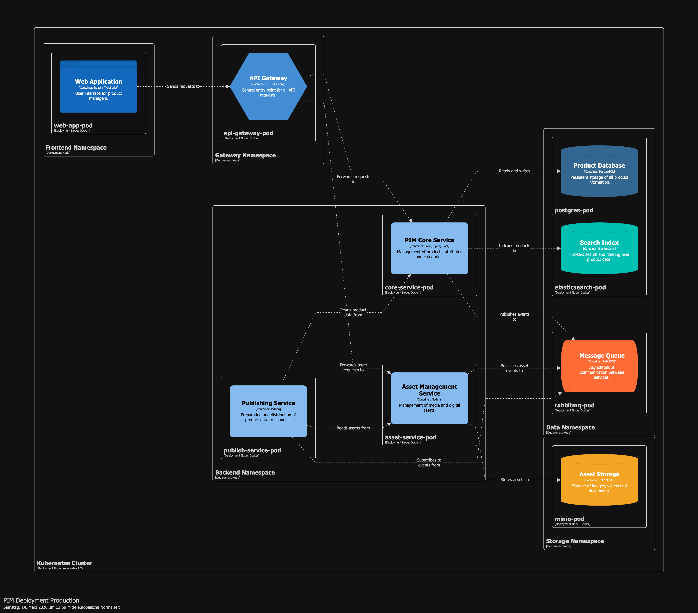 |

---

## Iteration 2: Extending via Handwritten Sketch

In a second iteration, the architecture was extended using a **handwritten sketch** — drawn on a reMarkable tablet and uploaded directly to Claude.

### The Sketch

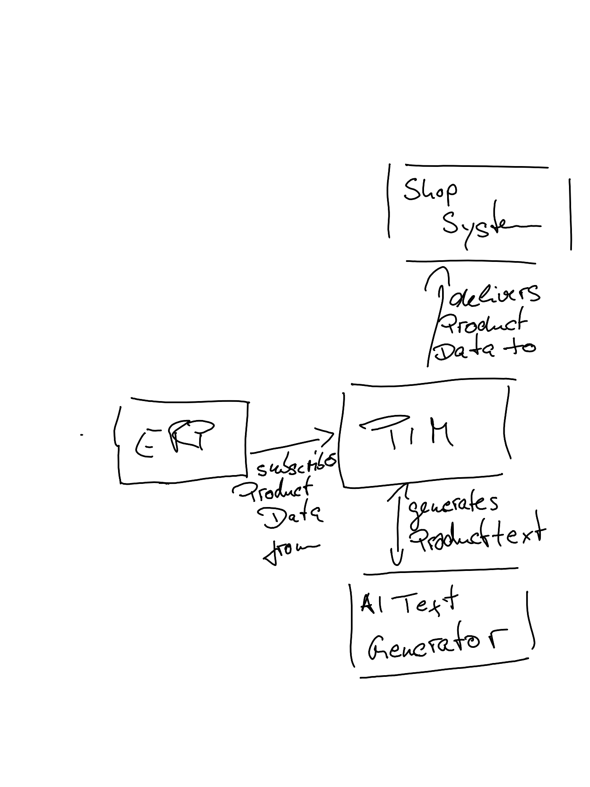

The sketch shows a new component — an **AI Text Generator** — connected to the PIM system. Claude reads the sketch as an image, identifies the new element and its relationships, and integrates them into the existing DSL workspace:

- PIM → AI Text Generator: *generates product text*
- The AI Text Generator becomes a new container inside the PIM system

No prompt engineering required — the image itself is the specification.

### Updated Diagrams

After Claude merged the sketch into the DSL, Structurizr rendered the updated architecture:

| View | Diagram |
|---|---|
| System Context | 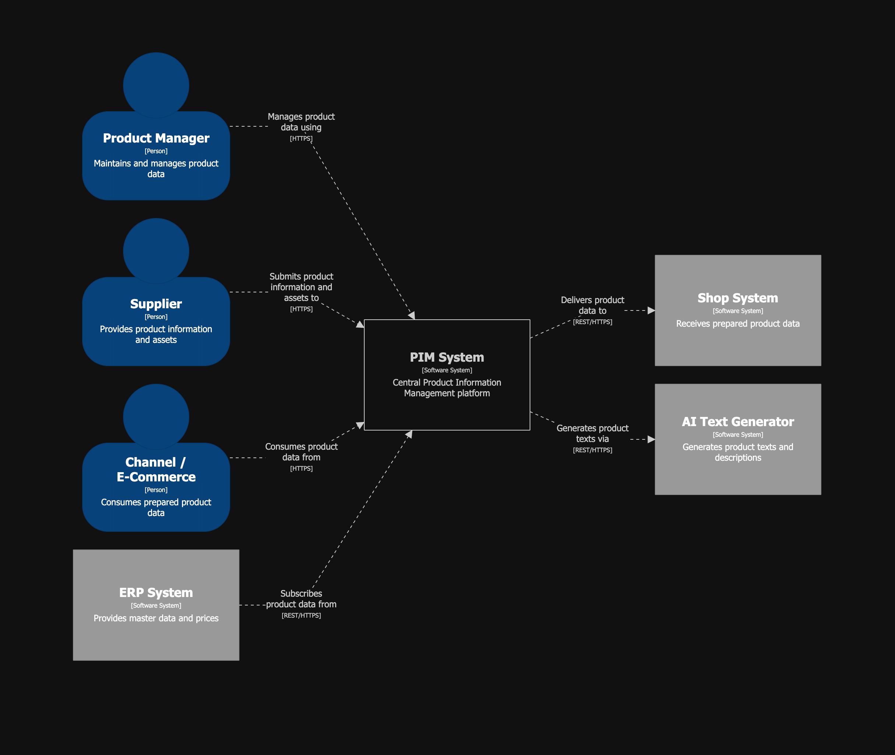 |
| Container Overview | 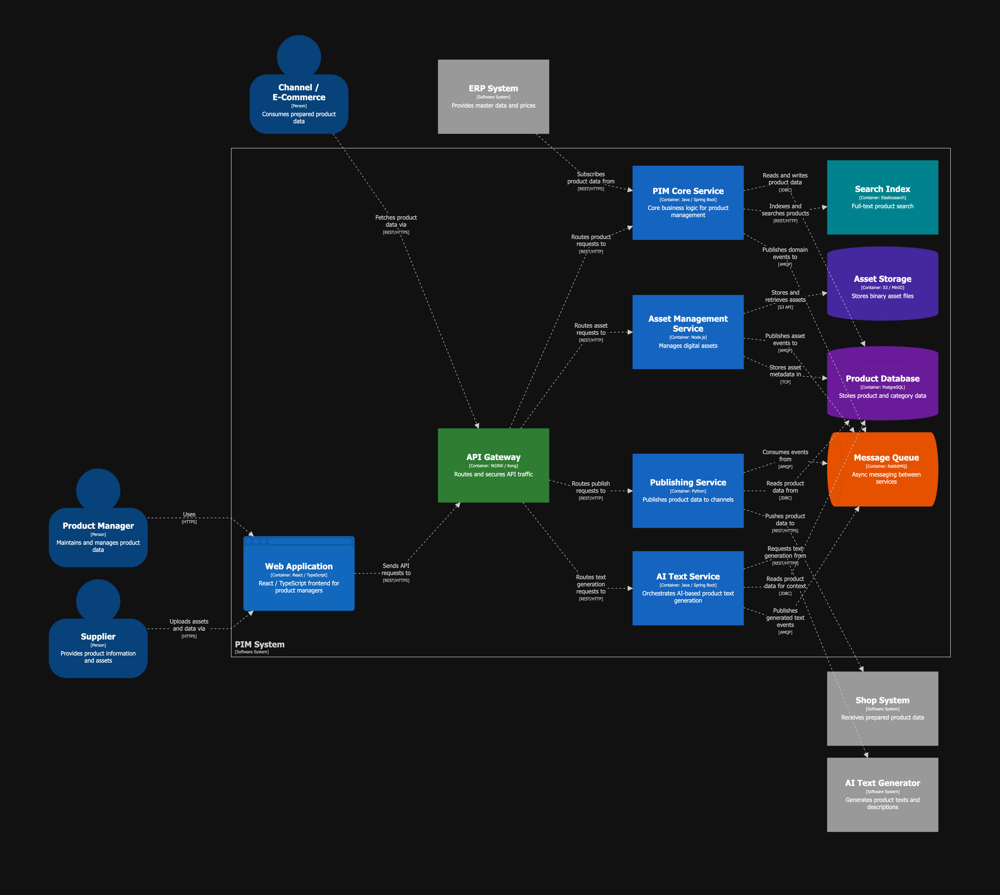 |
| Core Service Components | 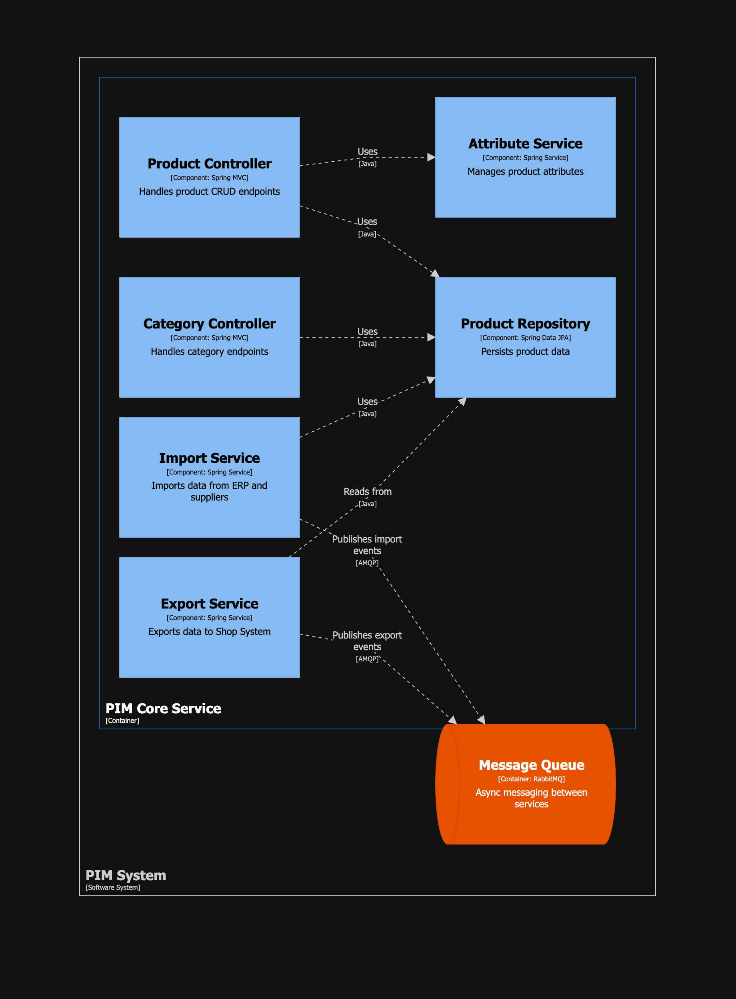 |
| Asset Service Components | 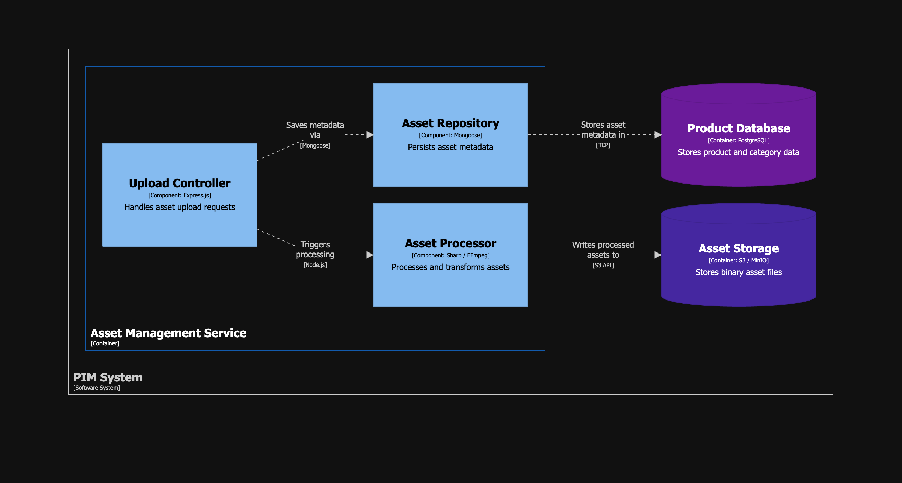 |
| AI Text Service Components | 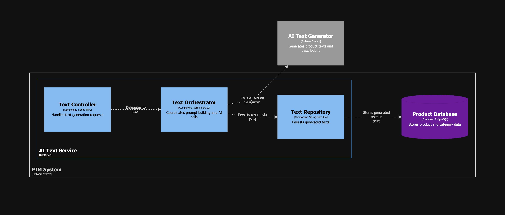 |
| Deployment (Production) | 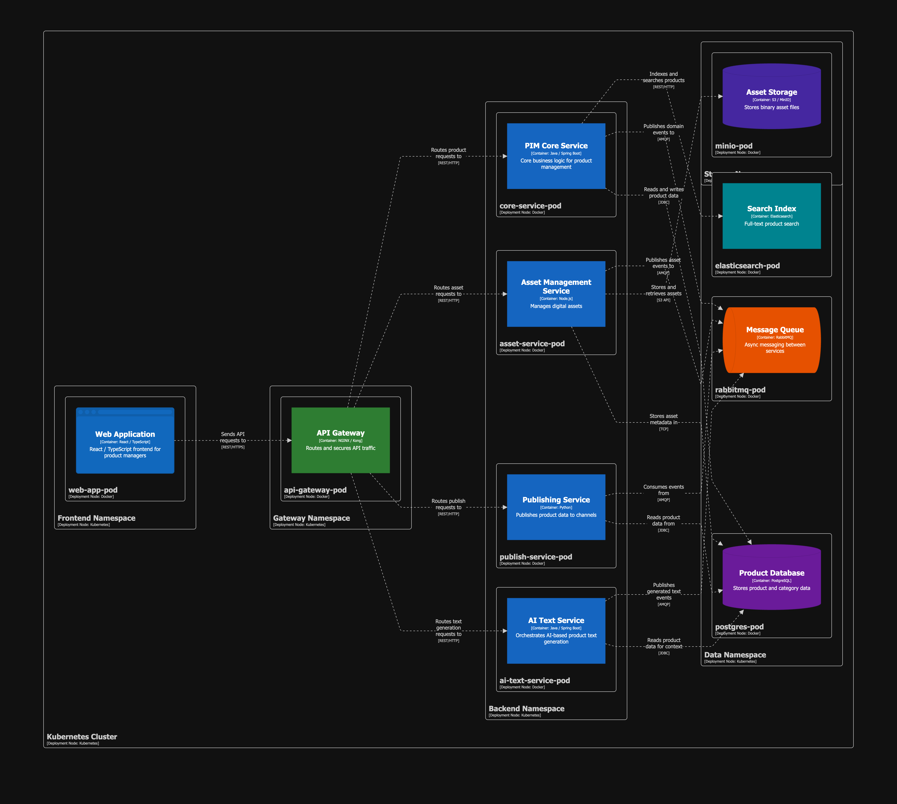 |

---

## Installation

See [Installation.md](Installation.md) for the full setup guide, including:

- Building the Structurizr Docker image
- Docker Compose configuration (Structurizr + MCP Server)
- Optional Caddy reverse proxy with HTTPS
- Claude Desktop configuration
- Claude project system prompt
- Available MCP tools
- Troubleshooting

---

## References

- [Structurizr Documentation](https://docs.structurizr.com/)
- [Structurizr MCP Server](https://docs.structurizr.com/ai/mcp)
- [C4 Model](https://c4model.com/)
- [Model Context Protocol](https://modelcontextprotocol.io/)
- [mcp-remote (npm)](https://www.npmjs.com/package/mcp-remote)
